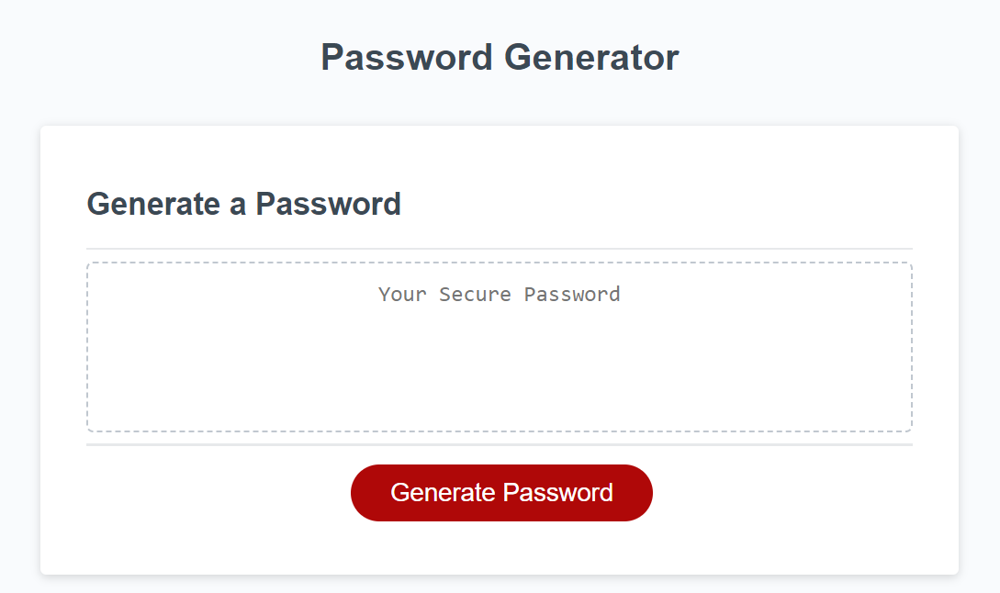
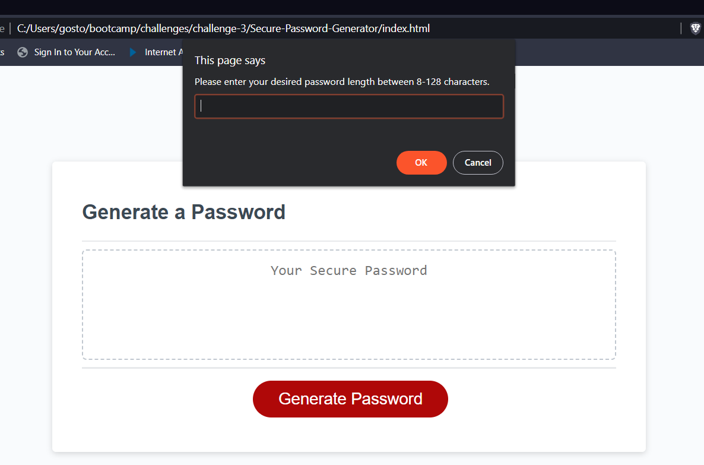
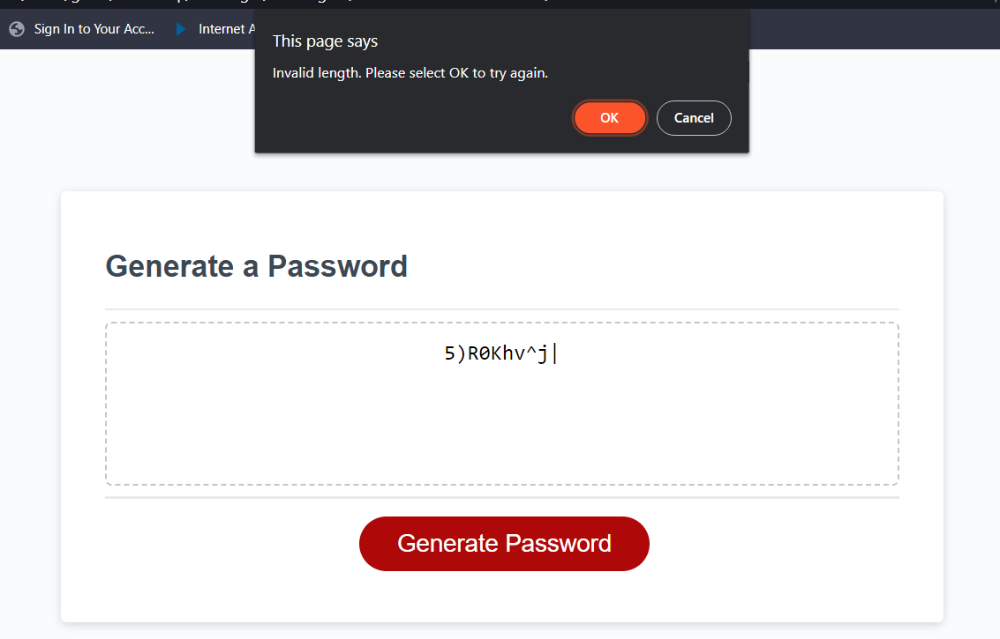
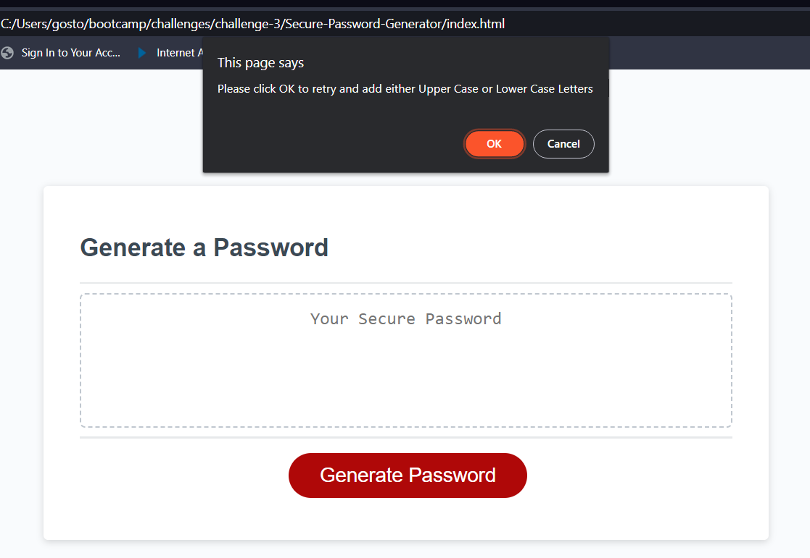
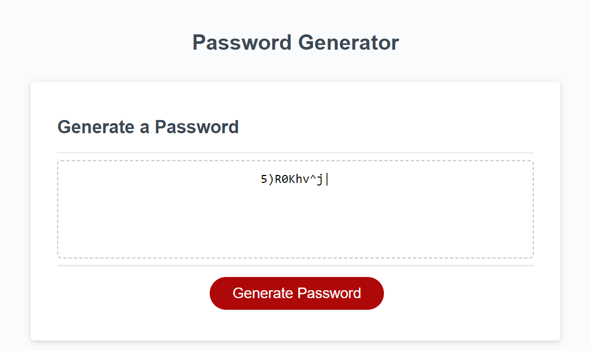

# Secure-Password-Generator
By Michael Gostomski

---

## Description
Javascript password generator. Capable of producing a unique password between 8-128 characters, consisting of user-selected character types. Validates user inputs at each step of the process.

---

## Installation
N/A

---

## Usage
Click the red button to begin the prompts. 

Enter a number between 8-128 to get started. 

You must enter a number between 8-128 or you will fail the validation check.

Then by clicking OK select special characters, numbers, or both. 

Then click OK to include upper case letters, lower case letters, or both. 

You must select at least one of each numbers/special characters and upper/lower case letters or the validation check will fail.

 Your fresh password will be displayed in the box.

 

---

## License
PLease refer to the license in the repo.

